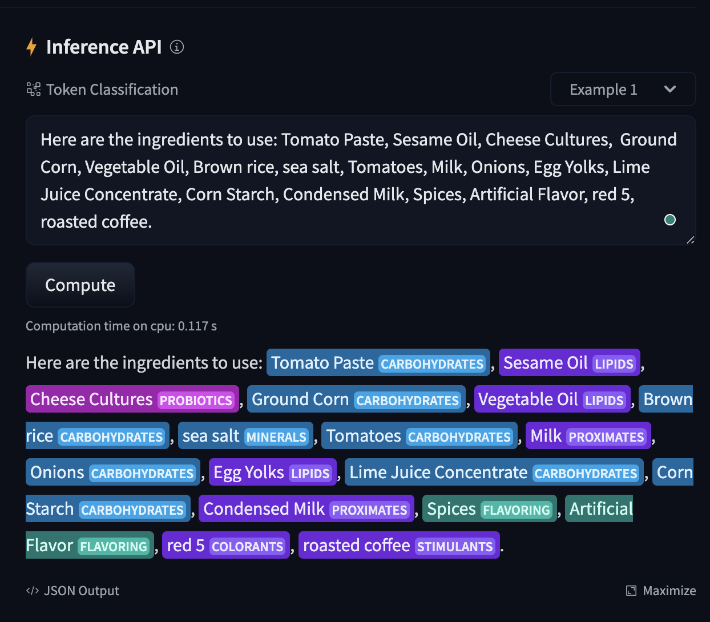

# bert-fda-nutrition-ner

This repository contains a PyTorch implementation of a BERT-based Named Entity Recognition (NER) model. The model is fine-tuned to identify and classify nutritional components in accordance with FDA guidelines using combined synthetic data for training. It utilizes the `bert-base-uncased` architecture and follows the BIO tagging scheme for entity recognition. The goal of this project is to accurately identify various nutritional entities such as vitamins, stimulants, proteins, and more.

This model is published on https://huggingface.co/sgarbi/bert-fda-nutrition-ner

## License

This project is shared under the MIT License. For more information, refer to the `LICENSE` file. While open-source, this project is developed and maintained exclusively by its creator, serving as a personal historical ledger on exploring of NER technologies.

